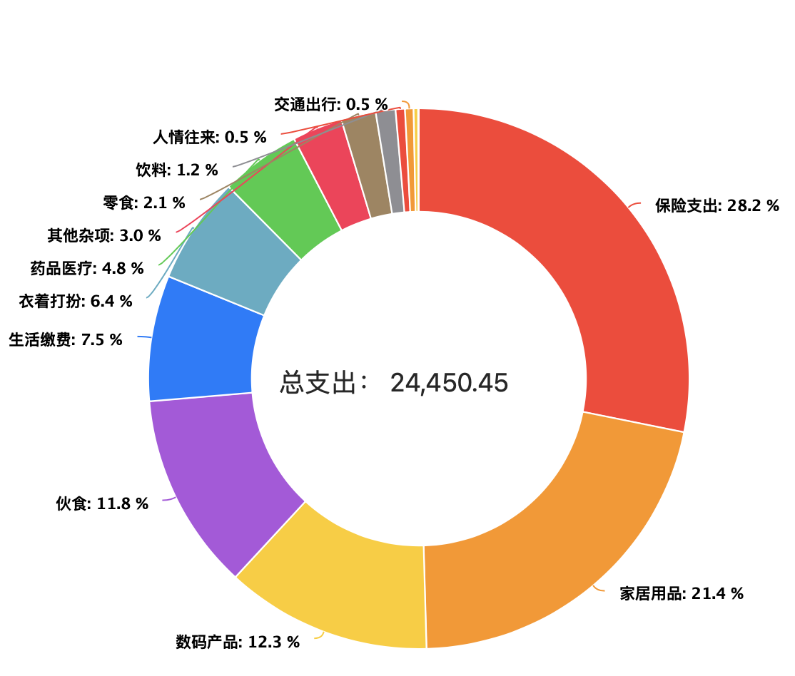

# 2021年12月份账单

具体的支出统计见下图

主要的支出是

- 保险风控，大概是约7000元买了四大保险，医疗险，意外险都挺便宜的；主要是重疾险与寿险比较贵
- 这个月因为从复旦大学生活园区搬到了尚景园，买了挺多的生活家居物品，如乳胶床垫等等
- 也是因为搬家，入手了一些数码产品，主要是极米H3S投影仪，大概是5500左右；还有Apple TV 4K也是1100左右
- 吃饭还有一些开销，还有生活缴费主要是宽带费880，生活园区的水电燃气费也交了
